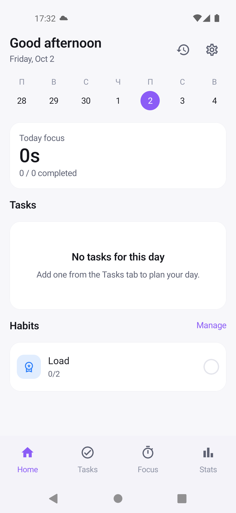

# FlowApp

A personal productivity app built natively for Android to demonstrate a modern, production style Kotlin stack: tasks, habits, a focus timer and statistics in one multi-module project.

Built as a portfolio project alongside my job search, using the same architecture and tooling I use professionally.

## Screenshot

## Features

- **Tasks** - create, organize and track to dos
- **Habits** - recurring habit tracking
- **Focus timer** - a Pomodoro style focus session timer
- **Statistics** - insights and progress over time

## Stack

- **UI:** Jetpack Compose
- **Architecture:** Multi-module (`app`, `core`, `feature`)
- **Local storage:** Room
- **Preferences:** DataStore
- **Dependency injection:** Koin
- **Build:** Gradle (Kotlin DSL), custom `build-logic` convention plugins
- **Presentation:** MVVM + MVI (unidirectional data flow) - each screen
  exposes a single immutable `UiState` via `StateFlow`, takes user input as
  sealed `UiAction`s through one `onAction()` entry point, and emits one off
  `UiEvent`s (navigation, messages) separately
## Roadmap

- Migrate navigation to **Navigation 3**
- Add basic **OWASP MASVS**-style hardening (frida hooks, root/emulator detection) as a demonstration of the same security practices used in production apps

## Related

An iOS version of this app exists at [FlowAppiOS](https://github.com/alwxezwei-del/FlowAppiOS) — ported from this codebase with AI assistance (Claude + GPT) and finished by hand.
